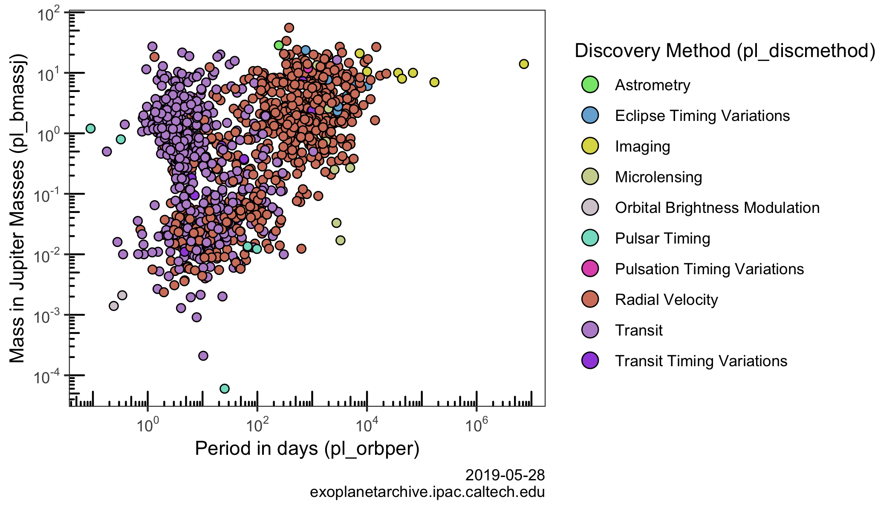

<!-- README.md is generated from README.Rmd. Please edit that file -->

# exoplanets 

<!-- badges: start -->

[](https://travis-ci.org/tyluRp/exoplanets)
[](https://ci.appveyor.com/project/tyluRp/exoplanets)
[](https://codecov.io/gh/tyluRp/exoplanets?branch=master)
<!-- badges: end -->

The goal of exoplanets is to provide access to [NASA’s Exoplanet
Archive](https://exoplanetarchive.ipac.caltech.edu/index.html) database
in R. The functionality of this package is very minimal and is simply an
R interface to access exoplanet data in the following ways:

  - By providing a table name
  - By providing a query URL



## Installation

You can install the development version from GitHub with:

``` r
# install.packages("devtools")
devtools::install_github("tylurp/exoplanets")
```

## Example

This is a basic example which shows you how to access data from the
exoplanet table:

``` r
library(exoplanets)
library(tibble)

exoplanets <- exo()

as_tibble(exoplanets)
#> # A tibble: 3,972 x 82
#>    pl_hostname pl_letter pl_name pl_discmethod pl_controvflag pl_pnum
#>    <chr>       <chr>     <chr>   <chr>                  <int>   <int>
#>  1 Kepler-162  c         Kepler… Transit                    0       2
#>  2 Kepler-163  b         Kepler… Transit                    0       2
#>  3 Kepler-163  c         Kepler… Transit                    0       2
#>  4 Kepler-164  b         Kepler… Transit                    0       3
#>  5 Kepler-164  c         Kepler… Transit                    0       3
#>  6 Kepler-164  d         Kepler… Transit                    0       3
#>  7 Kepler-165  b         Kepler… Transit                    0       2
#>  8 Kepler-165  c         Kepler… Transit                    0       2
#>  9 Kepler-166  b         Kepler… Transit                    0       3
#> 10 Kepler-166  c         Kepler… Transit                    0       3
#> # … with 3,962 more rows, and 76 more variables: pl_orbper <dbl>,
#> #   pl_orbpererr1 <dbl>, pl_orbpererr2 <dbl>, pl_orbperlim <int>,
#> #   pl_orbpern <int>, pl_orbsmax <dbl>, pl_orbsmaxerr1 <dbl>,
#> #   pl_orbsmaxerr2 <dbl>, pl_orbsmaxlim <int>, pl_orbsmaxn <int>,
#> #   pl_orbeccen <dbl>, pl_orbeccenerr1 <dbl>, pl_orbeccenerr2 <dbl>,
#> #   pl_orbeccenlim <int>, pl_orbeccenn <int>, pl_orbincl <dbl>,
#> #   pl_orbinclerr1 <dbl>, pl_orbinclerr2 <dbl>, pl_orbincllim <int>,
#> #   pl_orbincln <int>, pl_bmassj <dbl>, pl_bmassjerr1 <dbl>,
#> #   pl_bmassjerr2 <dbl>, pl_bmassjlim <int>, pl_bmassn <int>,
#> #   pl_bmassprov <chr>, pl_radj <dbl>, pl_radjerr1 <dbl>,
#> #   pl_radjerr2 <dbl>, pl_radjlim <int>, pl_radn <int>, pl_dens <dbl>,
#> #   pl_denserr1 <dbl>, pl_denserr2 <dbl>, pl_denslim <int>,
#> #   pl_densn <int>, pl_ttvflag <int>, pl_kepflag <int>, pl_k2flag <int>,
#> #   ra_str <chr>, dec_str <chr>, ra <dbl>, st_raerr <dbl>, dec <dbl>,
#> #   st_decerr <dbl>, st_posn <int>, st_dist <dbl>, st_disterr1 <dbl>,
#> #   st_disterr2 <dbl>, st_distlim <int>, st_distn <int>, st_optmag <dbl>,
#> #   st_optmagerr <dbl>, st_optmaglim <int>, st_optband <chr>,
#> #   gaia_gmag <dbl>, gaia_gmagerr <lgl>, gaia_gmaglim <int>,
#> #   st_teff <dbl>, st_tefferr1 <dbl>, st_tefferr2 <dbl>, st_tefflim <int>,
#> #   st_teffn <int>, st_mass <dbl>, st_masserr1 <dbl>, st_masserr2 <dbl>,
#> #   st_masslim <int>, st_massn <int>, st_rad <dbl>, st_raderr1 <dbl>,
#> #   st_raderr2 <dbl>, st_radlim <int>, st_radn <int>, pl_nnotes <int>,
#> #   rowupdate <chr>, pl_facility <chr>
```

To access data from a different table you can use the table parameter:

``` r
keplernames <- exo(table = "keplernames")

as_tibble(keplernames)
#> # A tibble: 2,350 x 13
#>     kepid    ra ra_err   dec dec_err ra_str dec_str kepoi_name kepler_name
#>     <int> <dbl>  <dbl> <dbl>   <dbl> <chr>  <chr>   <chr>      <chr>      
#>  1 1.10e7  293.      0  48.4       0 19h33… +48d26… K01931.02  Kepler-339…
#>  2 5.20e6  296.      0  40.3       0 19h43… +40d18… K01932.02  Kepler-340…
#>  3 5.20e6  296.      0  40.3       0 19h43… +40d18… K01932.01  Kepler-340…
#>  4 7.75e6  290.      0  43.5       0 19h19… +43d28… K01952.03  Kepler-341…
#>  5 7.75e6  290.      0  43.5       0 19h19… +43d28… K01952.01  Kepler-341…
#>  6 7.75e6  290.      0  43.5       0 19h19… +43d28… K01952.02  Kepler-341…
#>  7 7.75e6  290.      0  43.5       0 19h19… +43d28… K01952.04  Kepler-341…
#>  8 9.89e6  293.      0  46.7       0 19h30… +46d43… K01955.01  Kepler-342…
#>  9 9.89e6  293.      0  46.7       0 19h30… +46d43… K01955.04  Kepler-342…
#> 10 9.89e6  293.      0  46.7       0 19h30… +46d43… K01955.02  Kepler-342…
#> # … with 2,340 more rows, and 4 more variables: alt_name <chr>,
#> #   tm_designation <chr>, koi_list_flag <chr>, last_update <chr>
```

To get a list of all available tables:

``` r
names(tbls) 
#>  [1] "exoplanets"               "compositepars"           
#>  [3] "exomultpars"              "aliastable"              
#>  [5] "microlensing"             "cumulative"              
#>  [7] "q1_q17_dr25_sup_koi"      "q1_q17_dr25_koi"         
#>  [9] "q1_q17_dr24_koi"          "q1_q16_koi"              
#> [11] "q1_q12_koi"               "q1_q8_koi"               
#> [13] "q1_q6_koi"                "q1_q17_dr25_tce"         
#> [15] "q1_q17_dr24_tce"          "q1_q16_tce"              
#> [17] "q1_q12_tce"               "keplerstellar"           
#> [19] "q1_q17_dr25_supp_stellar" "q1_q17_dr25_stellar"     
#> [21] "q1_q17_dr24_stellar"      "q1_q16_stellar"          
#> [23] "q1_q12_stellar"           "keplertimeseries"        
#> [25] "keplernames"              "kelttimeseries"          
#> [27] "superwasptimeseries"      "k2targets"               
#> [29] "k2candidates"             "k2names"                 
#> [31] "missionstars"             "mission_exocat"
```

To get a vector of column names for a specific table:

``` r
str(exo_column_names("cumulative", "default"))
#>  chr [1:50] "kepid" "kepoi_name" "kepler_name" "koi_disposition" ...
str(exo_column_names("cumulative", "all"))
#>  chr [1:153] "kepid" "kepoi_name" "kepler_name" "ra" "ra_err" "ra_str" ...
```

Finally, you can take a look at the
[docs](https://exoplanetarchive.ipac.caltech.edu/docs/program_interfaces.html)
and use `eco_raw` to write out queries in their entirety. Spaces and
single quotes will be escaped automatically. The only supported format
is CSV so do not request JSON, ipac, or
others:

``` r
exoplanets2 <- exo_raw("https://exoplanetarchive.ipac.caltech.edu/cgi-bin/nstedAPI/nph-nstedAPI?table=exoplanets")

as_tibble(exoplanets2)
#> # A tibble: 3,972 x 82
#>    pl_hostname pl_letter pl_name pl_discmethod pl_controvflag pl_pnum
#>    <chr>       <chr>     <chr>   <chr>                  <int>   <int>
#>  1 Kepler-162  c         Kepler… Transit                    0       2
#>  2 Kepler-163  b         Kepler… Transit                    0       2
#>  3 Kepler-163  c         Kepler… Transit                    0       2
#>  4 Kepler-164  b         Kepler… Transit                    0       3
#>  5 Kepler-164  c         Kepler… Transit                    0       3
#>  6 Kepler-164  d         Kepler… Transit                    0       3
#>  7 Kepler-165  b         Kepler… Transit                    0       2
#>  8 Kepler-165  c         Kepler… Transit                    0       2
#>  9 Kepler-166  b         Kepler… Transit                    0       3
#> 10 Kepler-166  c         Kepler… Transit                    0       3
#> # … with 3,962 more rows, and 76 more variables: pl_orbper <dbl>,
#> #   pl_orbpererr1 <dbl>, pl_orbpererr2 <dbl>, pl_orbperlim <int>,
#> #   pl_orbpern <int>, pl_orbsmax <dbl>, pl_orbsmaxerr1 <dbl>,
#> #   pl_orbsmaxerr2 <dbl>, pl_orbsmaxlim <int>, pl_orbsmaxn <int>,
#> #   pl_orbeccen <dbl>, pl_orbeccenerr1 <dbl>, pl_orbeccenerr2 <dbl>,
#> #   pl_orbeccenlim <int>, pl_orbeccenn <int>, pl_orbincl <dbl>,
#> #   pl_orbinclerr1 <dbl>, pl_orbinclerr2 <dbl>, pl_orbincllim <int>,
#> #   pl_orbincln <int>, pl_bmassj <dbl>, pl_bmassjerr1 <dbl>,
#> #   pl_bmassjerr2 <dbl>, pl_bmassjlim <int>, pl_bmassn <int>,
#> #   pl_bmassprov <chr>, pl_radj <dbl>, pl_radjerr1 <dbl>,
#> #   pl_radjerr2 <dbl>, pl_radjlim <int>, pl_radn <int>, pl_dens <dbl>,
#> #   pl_denserr1 <dbl>, pl_denserr2 <dbl>, pl_denslim <int>,
#> #   pl_densn <int>, pl_ttvflag <int>, pl_kepflag <int>, pl_k2flag <int>,
#> #   ra_str <chr>, dec_str <chr>, ra <dbl>, st_raerr <dbl>, dec <dbl>,
#> #   st_decerr <dbl>, st_posn <int>, st_dist <dbl>, st_disterr1 <dbl>,
#> #   st_disterr2 <dbl>, st_distlim <int>, st_distn <int>, st_optmag <dbl>,
#> #   st_optmagerr <dbl>, st_optmaglim <int>, st_optband <chr>,
#> #   gaia_gmag <dbl>, gaia_gmagerr <lgl>, gaia_gmaglim <int>,
#> #   st_teff <dbl>, st_tefferr1 <dbl>, st_tefferr2 <dbl>, st_tefflim <int>,
#> #   st_teffn <int>, st_mass <dbl>, st_masserr1 <dbl>, st_masserr2 <dbl>,
#> #   st_masslim <int>, st_massn <int>, st_rad <dbl>, st_raderr1 <dbl>,
#> #   st_raderr2 <dbl>, st_radlim <int>, st_radn <int>, pl_nnotes <int>,
#> #   rowupdate <chr>, pl_facility <chr>
```
