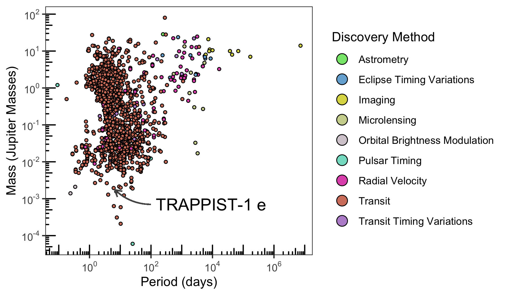

In this vignette, we will cover all functionality in `exoplanets` by recreating the discovery plot shown in the packages README file. First, we'll need to load the package.


```r
library(exoplanets)
library(dplyr, warn.conflicts = FALSE)
library(ggplot2)
```

We will need a couple of columns to recreate the plot:

* The planet name
* The planets mass (jupiter)
* The orbital period (in days)
* The discovery method

To identify the column names that represent these things, we have two options:

* Consult the documentation at https://exoplanetarchive.ipac.caltech.edu/docs/TAP/usingTAP.html
* Review the table information with `tableinfo`

I'd encourage you to read the documentation if you're interested in all the details, it is especially useful to familiarize yourself with what you need. In this example, we are interested in the Planetary Systems (PS) table. Per the documentation you will find:

> PS provides a single table view of the all of the ingested planetary systems for each known exoplanet with each row containing a self-contained set of parameters (planet + stellar + system) for each reference. The PS Table contains one row per planet per reference.

The columns we actually need are:

* `pl_name`
* `pl_orbper`
* `pl_massj`
* `discoverymethod`

We can find these columns and their description in the `tableinfo` dataset.


```r
tableinfo %>%
  filter(table == "ps") %>%
  select(database_column_name, description) %>%
  filter(database_column_name %in% c(
    "pl_name",
    "pl_orbper",
    "pl_massj",
    "discoverymethod"
  ))
#> # A tibble: 4 x 2
#>   database_column_name description                                                          
#>   <chr>                <chr>                                                                
#> 1 pl_name              Planet name most commonly used in the literature                     
#> 2 discoverymethod      Method by which the planet was first identified                      
#> 3 pl_orbper            Time the planet takes to make a complete orbit around the host star …
#> 4 pl_massj             Amount of matter contained in the planet, measured in units of masse…
```

In general, if you have a specific set of columns you need, requesting those columns will be quicker than requesting all columns (default behavior). Let's request only what we need.


```r
discovery <- exoplanets(
  table = "ps",
  columns = c(
    "pl_name",
    "pl_orbper",
    "pl_massj",
    "discoverymethod"
  )
)
#> • https://exoplanetarchive.ipac.caltech.edu/TAP/sync?query=select+pl_name,pl_orbper,pl_massj,discoverymethod+from+ps&format=csv
#> Rows: 29683 Columns: 4
#> ── Column specification ────────────────────────────────────────────────────────────────────
#> Delimiter: ","
#> chr (2): pl_name, discoverymethod
#> dbl (2): pl_orbper, pl_massj
#> 
#> ℹ Use `spec()` to retrieve the full column specification for this data.
#> ℹ Specify the column types or set `show_col_types = FALSE` to quiet this message.

discovery
#> # A tibble: 29,683 x 4
#>    pl_name      pl_orbper pl_massj discoverymethod
#>    <chr>            <dbl>    <dbl> <chr>          
#>  1 Kepler-11 c      13.0     0.042 Transit        
#>  2 Kepler-11 f      46.7     0.007 Transit        
#>  3 HAT-P-1 b         4.47    0.532 Transit        
#>  4 OGLE-TR-10 b      3.10    0.62  Transit        
#>  5 TrES-2 b          2.47    1.20  Transit        
#>  6 WASP-3 b          1.85    1.76  Transit        
#>  7 HD 210702 b     354.     NA     Radial Velocity
#>  8 BD-08 2823 b      5.6    NA     Radial Velocity
#>  9 BD-08 2823 c    238.     NA     Radial Velocity
#> 10 HAT-P-30 b        2.81    0.711 Transit        
#> # … with 29,673 more rows
```

Finally, we can recreate the plot.


```r
cols_vec <- c("#86E57B", "#77AFD7", "#DCD955", "#CFD49C", "#D5CCD1", "#84DECA", "#E15AB9", "#D4816C", "#BA91D1", "#A152DF")

discovery %>%
  filter(
    !is.na(pl_massj),
    !is.na(pl_orbper),
    !is.na(discoverymethod)
  ) %>%
  ggplot(aes(pl_orbper, pl_massj)) +
  geom_point(aes(fill = discoverymethod), color = "black", shape = 21, size = 1) +
  scale_x_log10(
    breaks = scales::trans_breaks("log10", function(x) 10^x),
    labels = scales::trans_format("log10", scales::math_format(10^.x))
  ) +
  scale_y_log10(
    breaks = scales::trans_breaks("log10", function(x) 10^x),
    labels = scales::trans_format("log10", scales::math_format(10^.x))
  ) +
  labs(
    x = "Period (days)",
    y = "Mass (Jupiter Masses)",
    fill = "Discovery Method"
  ) +
  annotation_logticks() +
  scale_fill_manual(values = cols_vec) +
  guides(fill = guide_legend(override.aes = list(size = 4))) +
  geom_curve(
    aes(x = 100, y = 0.00070, xend = 6.0996151 + 0.6, yend = 0.00194 - 0.0002),
    colour = "#555555",
    size = 0.5,
    curvature = -0.2,
    arrow = arrow(length = unit(0.03, "npc"))
  ) +
  geom_label(
    aes(x = 100, y = 0.00070, label = "TRAPPIST-1 e"),
    hjust = 0,
    vjust = 0.5,
    label.size = NA,
    size = 5
  ) +
  theme_bw() +
  theme(panel.grid = element_blank())
```



And in case you were wondering, we've highlighted TRAPPIST-1e, an exoplanet considered to be one of the most potentially habitable exoplanets discovered so far.
